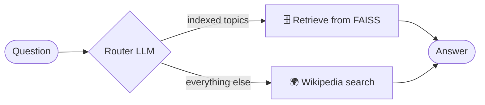

<div align="center">

# 🕸️ Multi-Agent RAG with LangGraph

**A LangGraph workflow that decides whether to answer from a local vector store or from Wikipedia - powered by Groq's Llama 3.1 70B.**


</div>

---

## ✨ Overview

`mutltiagentRAG.ipynb` implements an agentic RAG system:

- 📚 **Vector store** - blog posts are loaded with `WebBaseLoader`, split into chunks, embedded with `sentence-transformers/all-MiniLM-L6-v2` and indexed in **FAISS**.
- 🌍 **Wikipedia search** - a second tool for questions outside the indexed documents.
- 🧭 **Router** - the LLM (`Llama-3.1-70b-versatile` on **Groq**) chooses the right source for each question.
- 🕸️ **LangGraph** - a `StateGraph` with `wiki_search` and `retrieve` nodes and conditional edges produces the final answer.



[](https://colab.research.google.com/github/Arashomranpour/multiagent/blob/main/mutltiagentRAG.ipynb)

## 🚀 Getting Started

1. Get a [Groq API key](https://console.groq.com/keys) and a [Hugging Face token](https://huggingface.co/settings/tokens).
2. In Colab, store the Groq key as a secret named `groq_api_key`; locally, set it as an environment variable.

```bash
git clone https://github.com/Arashomranpour/multiagent.git
cd multiagent
pip install -r requirements.txt
jupyter notebook mutltiagentRAG.ipynb
```

## 📁 Project Structure

```
.
├── mutltiagentRAG.ipynb   # Vector store, router, LangGraph workflow
└── requirements.txt
```

## 🛠️ Tech Stack

`LangGraph` · `LangChain` · `Groq` · `FAISS` · `Hugging Face embeddings`
